# Block Chain

# ZBank
We will create a genesis block from scratch and construct and connect two nodes using geth so that they can be mined for Ethereum.  We will then use a custom testnet node on the MyCrypto platform to send a transaction (test) between public addresses we created.

## Instructions
Run 'puppeth', name your network and select the option to configure a new genesis block:
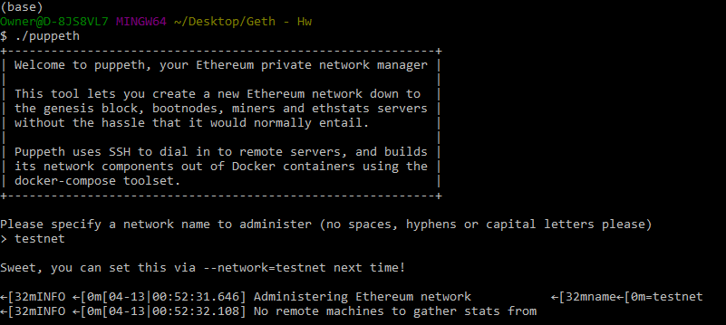

Choose the 'Clique (Proof of Authority)' consensus algorithm. Then paste both account addresses from the first step one at a time into the list of accounts to seal:
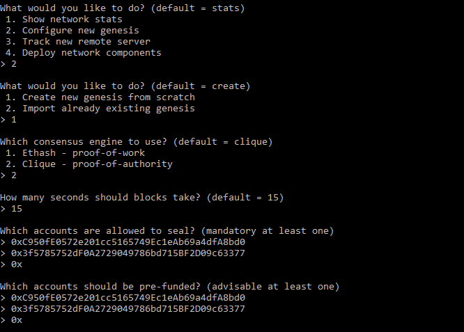

Specify ChainID to complete new genesis block configuration:
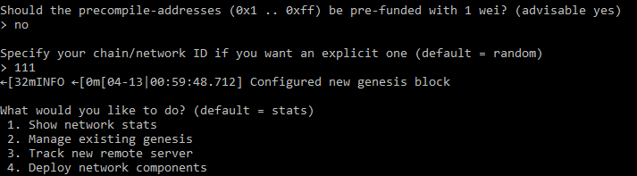

Manage existing genesis and export the configuration to a folder:
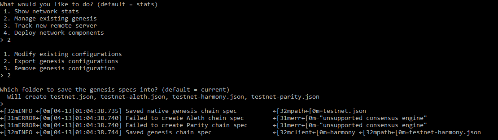

A view of the genesis configuration in folder:
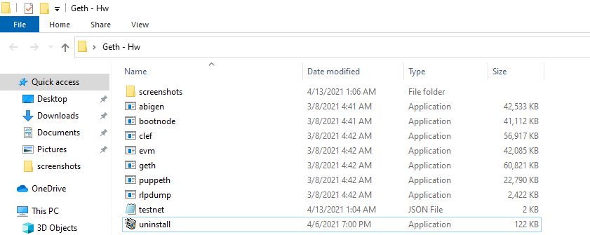

Unlock accounts to setup the nodes:
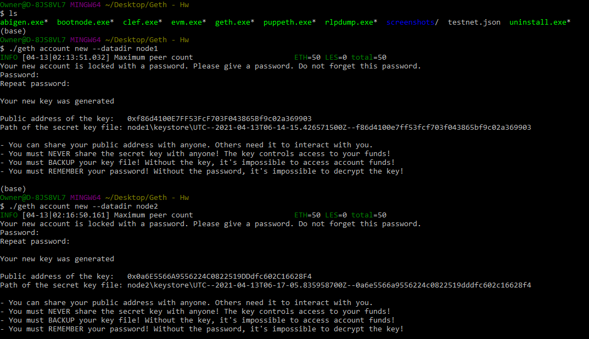

Initialize the nodes:
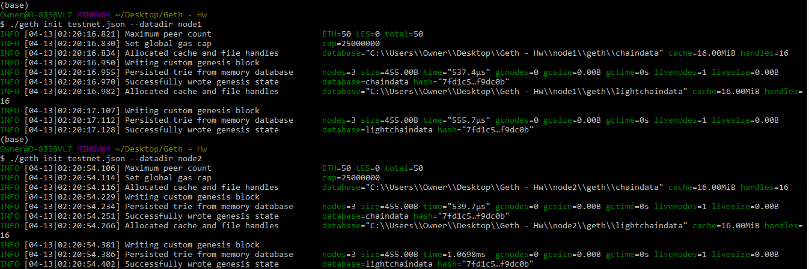

Startup the nodes:
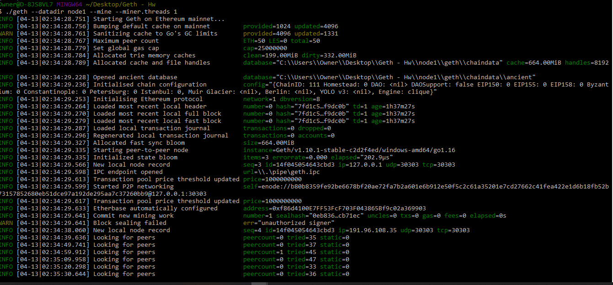

Unlock and start mining in node1:
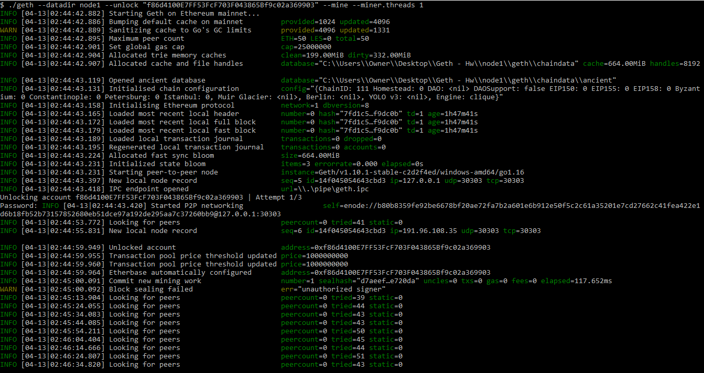
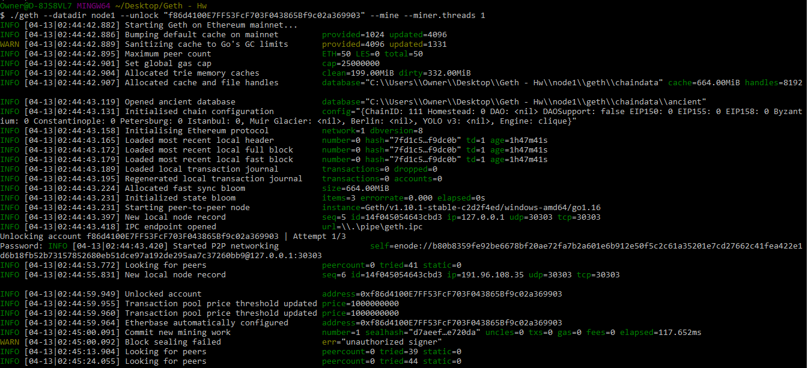

Under ideal circumstances we would expect a successful mining operation.  In that scenario, you would see little hammer images indicating the mining process is underway.  Instead, as you can see below, our code only generated "Looking for peers" notices due to errors the Bootcamp staff is aware of and working on:
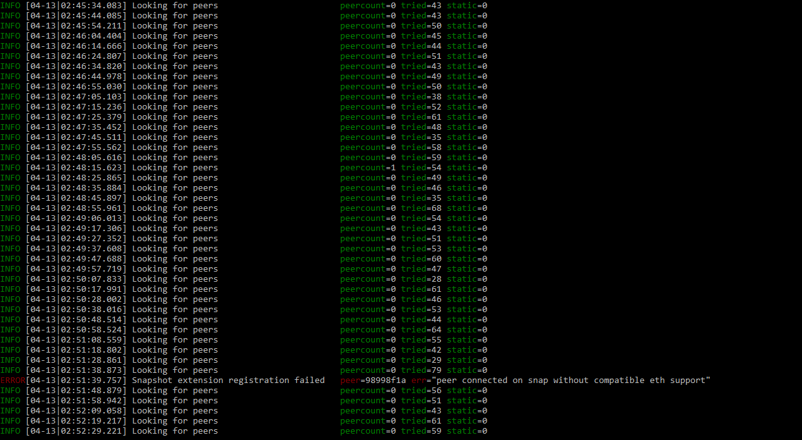

Unlock and start Node 2 in a separate GitBash:
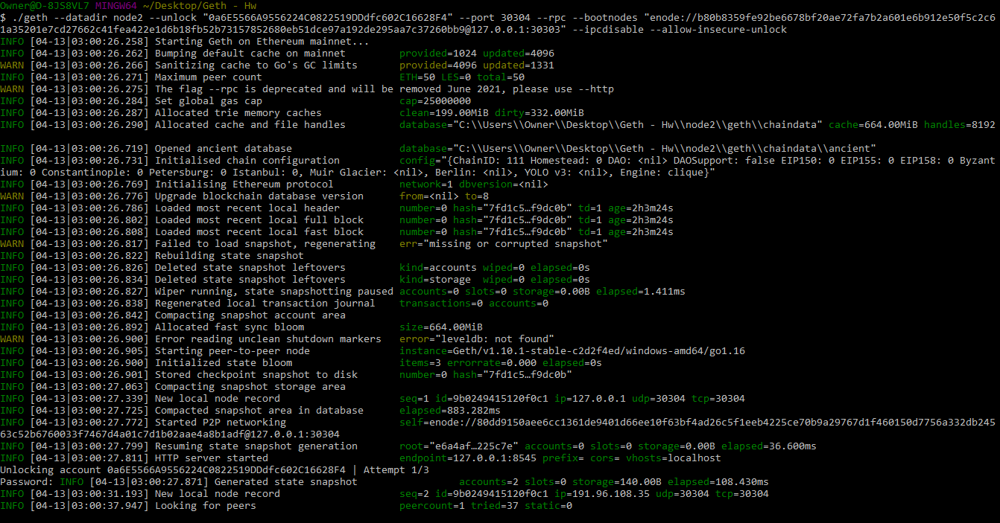
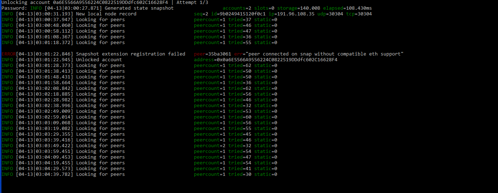

In the Mycrypto app, generate and copy a Private Key for each address:
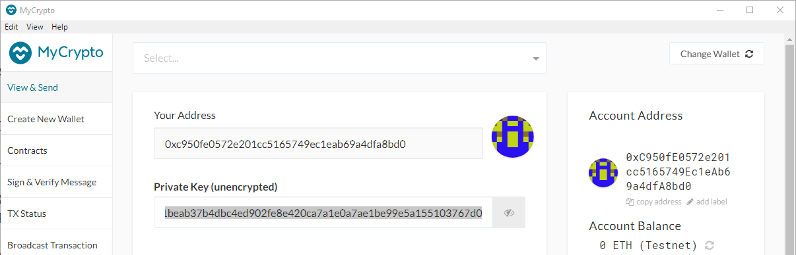
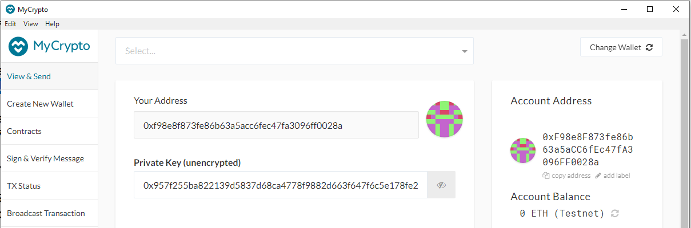

Setup custom node:
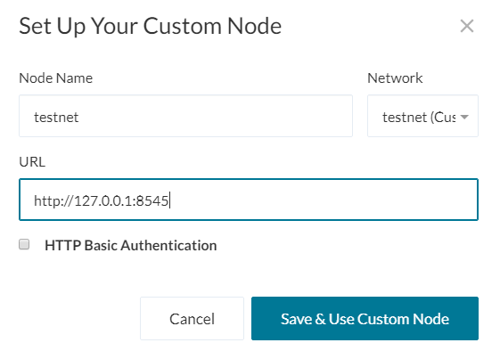

Unlock with the Private Key previously copied:
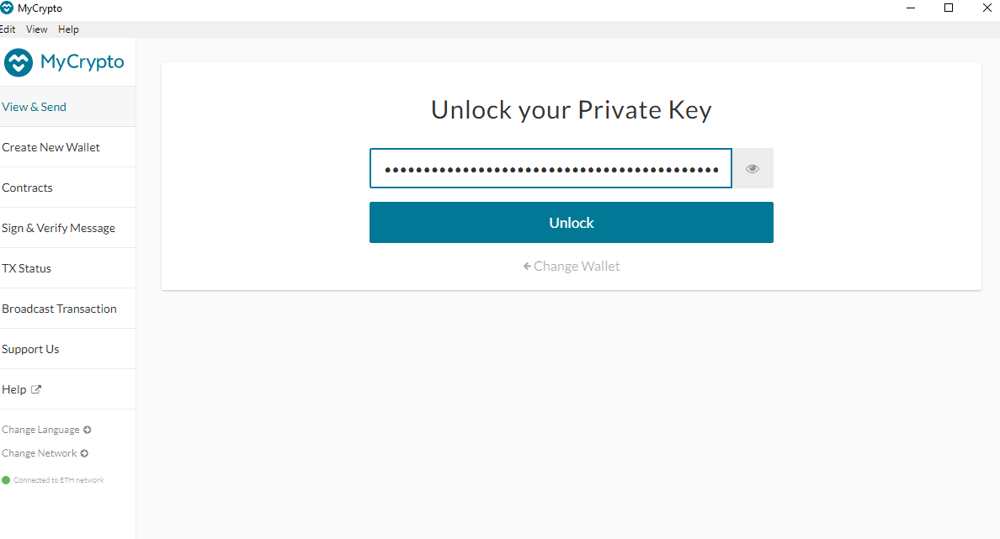

Review account balance (shown on right side of image):
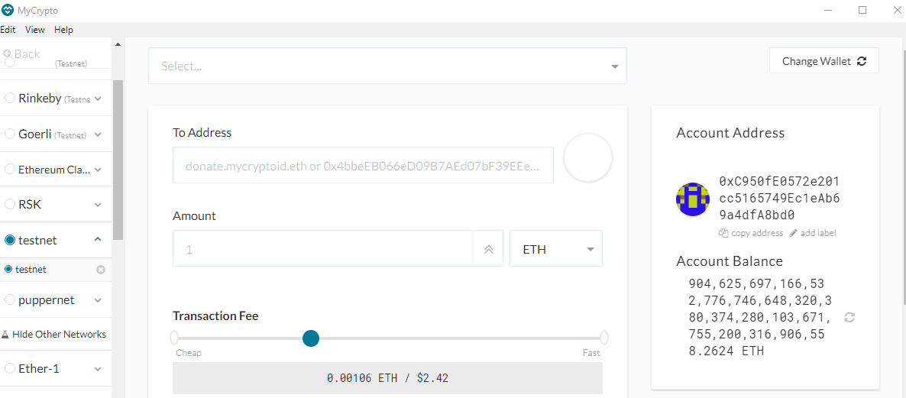

A balance was generated but due to the previous errors beyond our control, the coin choice of "ZBankCoin" is not reflect and the transfer is not able to proceed.